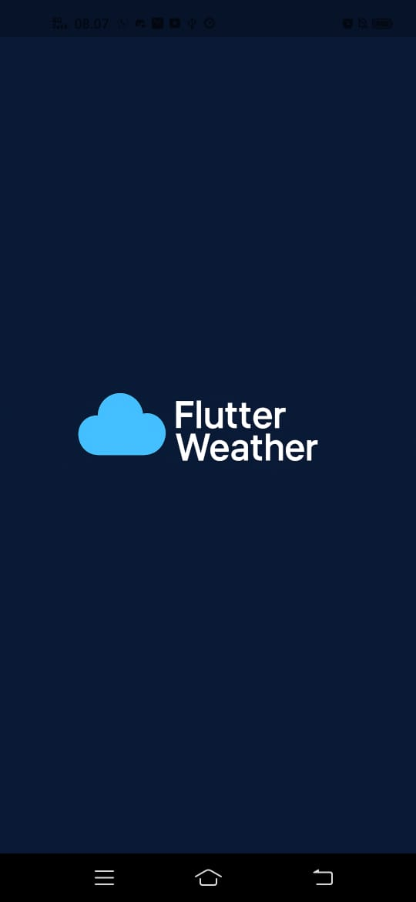
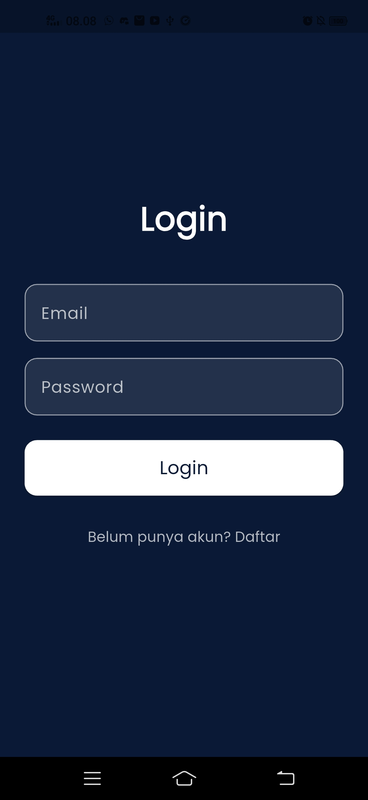
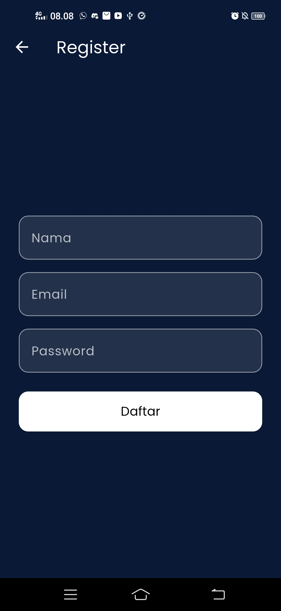
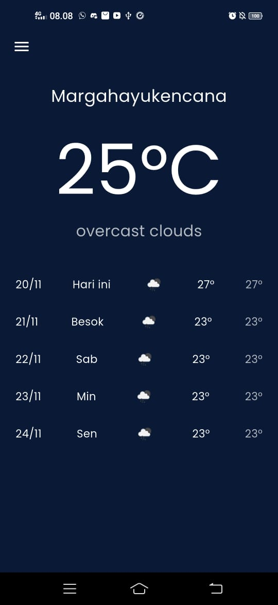
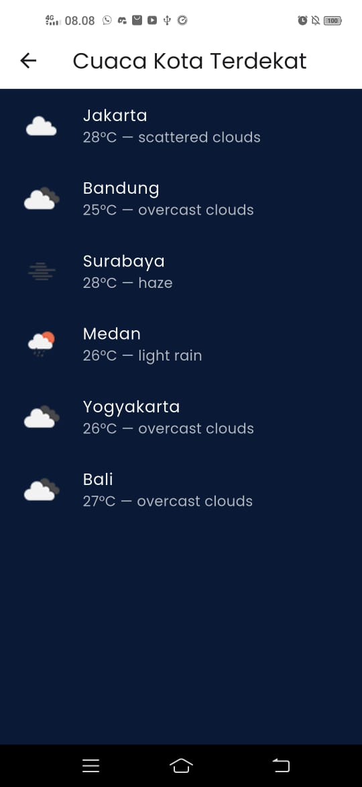
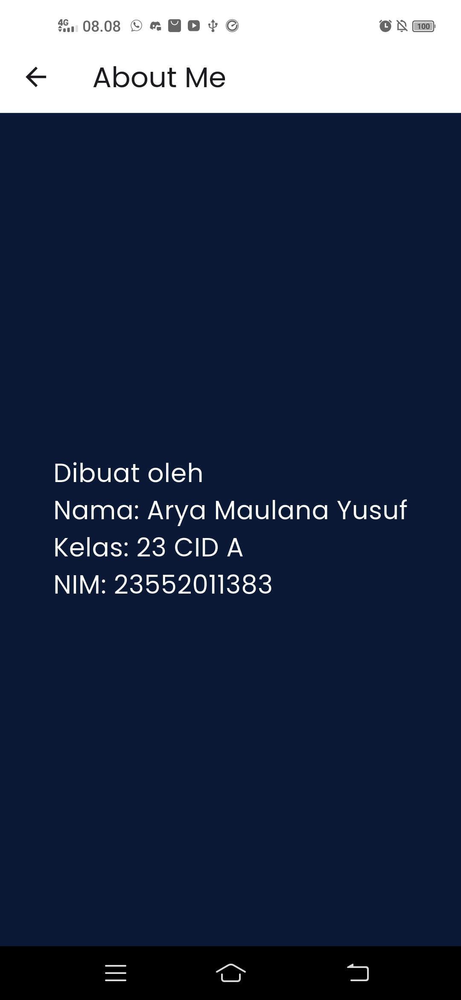

# 🌤️ Weather App --- Flutter

Aplikasi cuaca sederhana berbasis **Flutter** yang menampilkan:

-   Cuaca saat ini berdasarkan **lokasi GPS**\
-   Prakiraan cuaca **5 hari ke depan**\
-   Daftar cuaca **kota-kota terdekat**\
-   Navigasi drawer (Home / Kota / About)

Aplikasi ini menggunakan API dari **OpenWeatherMap**.

## 🚀 Fitur Utama

### 📍 Cuaca Saat Ini (GPS)

-   Mengambil lokasi pengguna menggunakan `geolocator`
-   Menampilkan suhu, kota, ikon cuaca, dan deskripsi

### 📅 Prakiraan 5 Hari

-   Menggunakan endpoint **/forecast**
-   Menampilkan cuaca harian (jam 12:00)\
-   Max/min temperature tiap hari

### 🏙️ Daftar Cuaca Kota Terdekat

-   Beberapa kota Indonesia
-   Tampilkan suhu & ikon cuaca tiap kota

### 📑 Drawer Navigation

-   Home
-   Cuaca Kota
-   About

## 🛠️ Teknologi yang Digunakan

  Komponen             Deskripsi
  -------------------- ----------------------------------
  Flutter              UI Framework
  Geolocator           Mendapatkan GPS perangkat
  HTTP                 Request ke OpenWeather API
  Flutter Dotenv       Menyimpan API Key aman di `.env`
  OpenWeatherMap API   Data cuaca

## 📦 Instalasi

### 1️⃣ Clone Repository

``` bash
git clone https://github.com/Creamoka/flutter_wheater.git
cd weatherapp
```

### 2️⃣ Dependencies

``` bash
flutter pub get
```

### 3️⃣ Buat File `.env`

    API_KEY=MASUKKAN_API_KEY_OWM_KAMU

### 4️⃣ Tambahkan ke `pubspec.yaml`

``` yaml
flutter:
  assets:
    - .env
```

### 5️⃣ Jalankan Aplikasi

``` bash
flutter run
```

## 🗂 Struktur Proyek

    lib/
    │── home.dart
    │── city.dart
    │── about.dart
    │── main.dart

## ⚠️ Permissions

AndroidManifest.xml:

``` xml
<uses-permission android:name="android.permission.ACCESS_FINE_LOCATION"/>
<uses-permission android:name="android.permission.ACCESS_COARSE_LOCATION"/>
```

## 🐛 Troubleshooting

-   Timeout GPS → aktifkan GPS high accuracy, coba restart aplikasi.

## 📜 Screenshot

-   Splashscreen


-   Login


-   Register


-   Home


-   Kota


-   Aboutme
